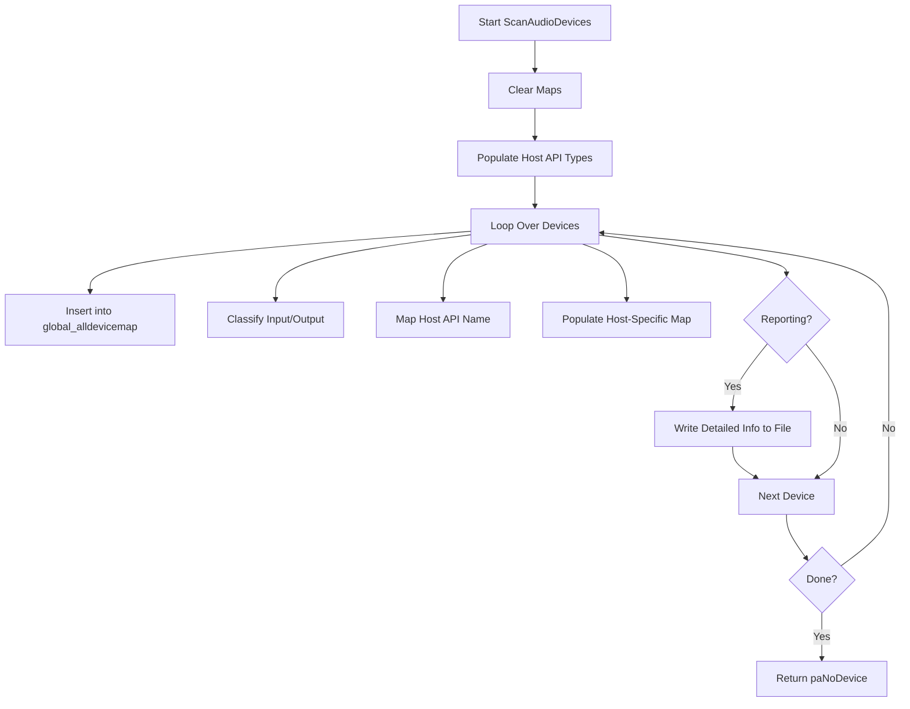

# Audio Device Selection and Configuration (SPIAudioDevice)

This section explains how SPIAudioDevice discovers, categorizes, and reports on available audio devices via PortAudio. It details the data structures used, the scanning process, and the optional reporting functionality.

## Key Data Structures

Below are the primary maps and parameters SPIAudioDevice uses to store device information:

| Map Name | Purpose |
| --- | --- |
| **global_alldevicemap** | All devices: ID → Name |
| **global_inputdevicemap** | Input-capable devices: ID → Name |
| **global_outputdevicemap** | Output-capable devices: ID → Name |
| **global_hostapimap** | Device ID → Host API name |
| **global_hostapimap_directsound** | DirectSound devices: ID → Name |
| **global_hostapimap_mme** | MME devices: ID → Name |
| **global_hostapimap_asio** | ASIO devices: ID → Name |
| **global_hostapimap_coreaudio** | CoreAudio devices (cross-platform stub): ID → Name |
| **global_hostapimap_alsa** | ALSA devices (cross-platform stub): ID → Name |
| … | Additional host-API maps for SoundManager, OSS, WDM-KS, WASAPI, etc. |


Additional fields:

- `bdetailedreport` (bool)
- `m_pFILE` (`FILE*`) – optional file handle for writing reports
- PortAudio parameters:
- `global_inputParameters`, `global_outputParameters`
- ASIO info: `global_asioInputInfo`, `global_asioOutputInfo`

## ScanAudioDevices Method

This core method performs device enumeration and optional reporting:

```cpp
int SPIAudioDevice::ScanAudioDevices(string matchmode, spiaudiodevicetypeflag ioflag) {
    // If matchmode is empty, clear all maps and populate them
    global_alldevicemap.clear();
    global_inputdevicemap.clear();
    global_outputdevicemap.clear();
    global_hostapimap.clear();
    // Initialize host-API type names
    global_hostapimap_hostapitype.insert({ paDirectSound, "DIRECTSOUND" });
    global_hostapimap_hostapitype.insert({ paMME,         "MME"         });
    global_hostapimap_hostapitype.insert({ paASIO,        "ASIO"        });
    … 
    // Clear host-API specific maps
    global_hostapimap_directsound.clear();
    global_hostapimap_mme.clear();
    global_hostapimap_asio.clear();
    global_hostapimap_coreaudio.clear();
    // …
    const PaDeviceInfo* deviceInfo;
    int numDevices = Pa_GetDeviceCount();
    for (int i = 0; i < numDevices; i++) {
        deviceInfo = Pa_GetDeviceInfo(i);
        string name = deviceInfo->name;
        global_alldevicemap.insert({ i, name });
        if (deviceInfo->maxInputChannels  > 0  && (ioflag & spiaudiodeviceINPUT))
            global_inputdevicemap.insert({ i, name });
        if (deviceInfo->maxOutputChannels > 0  && (ioflag & spiaudiodeviceOUTPUT))
            global_outputdevicemap.insert({ i, name });
        // Host API mapping
        auto hostInfo = Pa_GetHostApiInfo(deviceInfo->hostApi);
        global_hostapimap.insert({ i, hostInfo->name });
        // API-specific categorization
        if (hostInfo->type == paDirectSound) global_hostapimap_directsound.insert({ i, name });
        else if (hostInfo->type == paMME)        global_hostapimap_mme.insert({ i, name });
        else if (hostInfo->type == paASIO)       global_hostapimap_asio.insert({ i, name });
        … 
        // Detailed reporting
        if (m_pFILE && bdetailedreport) {
            fprintf(m_pFILE, "--------------------------------------- device #%d\n", i);
            // Mark default devices
            // Print ID, host API, name, channel counts, latencies
            fprintf(m_pFILE, "Max inputs = %d, Max outputs = %d\n",
                    deviceInfo->maxInputChannels, deviceInfo->maxOutputChannels);
            fprintf(m_pFILE, "Default low input latency   = %8.4f\n", deviceInfo->defaultLowInputLatency);
            fprintf(m_pFILE, "Default high output latency = %8.4f\n", deviceInfo->defaultHighOutputLatency);
            #if PA_USE_ASIO
            if (hostInfo->type == paASIO) {
                long minL, maxL, prefL, gran;
                PaAsio_GetAvailableLatencyValues(i, &minL, &maxL, &prefL, &gran);
                fprintf(m_pFILE, "ASIO minimum buffer size    = %ld\n", minL);
                // …
            }
            #endif
            fprintf(m_pFILE, "----------------------------------------------\n\n");
        }
    }
    return paNoDevice;
}
```

*Implementation details:*

### Enumeration Phase

- 🔄 **Clear existing maps** when `matchmode` is empty.
- 🗺 **Populate host-API names** in `global_hostapimap_hostapitype`.
- 🔌 **Reset** per-API maps (DirectSound, MME, ASIO, etc.).

### Device Loop

For each device index:

1. Retrieve `PaDeviceInfo`.
2. Insert into **global maps**.
3. **Classify** as input/output based on channel counts.
4. Map to **host API** name and assign to API-specific map.
5. If reporting is enabled, **log detailed info** to `devices.txt`.

### Reporting Output

When `m_pFILE != NULL` and `bdetailedreport == true`, the method writes:

- Default device markers (system default & per-API default).
- Device **ID**, **host API**, and **name**.
- **Maximum channel counts**.
- **Default low/high latencies**.
- **ASIO** buffer size ranges and granularity (if `PA_USE_ASIO`).

## Process Flowchart



## Integration and Usage

> devices.txt is generated before selecting the output device in `spispectrumplay.cpp`, offering a snapshot of available devices for user reference.

- **Initialization**

PortAudio must be initialized (`Pa_Initialize()`) before scanning.

- **Invocation**

```cpp
  // In spispectrumplay.cpp
  FILE* pFILE = fopen("devices.txt", "w");
  mySPIAudioDevice.m_pFILE = pFILE;
  mySPIAudioDevice.ScanAudioDevices("", spiaudiodeviceALL);
  fclose(pFILE);
  mySPIAudioDevice.m_pFILE = NULL;
```

This generates `devices.txt` for user inspection before device selection.

- **Device Selection**

Maps populated here feed into `SelectAudioInputDevice()` and `SelectAudioOutputDevice()`, enabling logical device matching and stream setup.

---

```card
{
    "title": "Pro Tip",
    "content": "Enable `bdetailedreport` before scanning to capture full latency details in devices.txt."
}
```