# Audio Device Selection and Configuration (SPIAudioDevice)

The **SPIAudioDevice** class handles enumeration, matching, and selection of audio devices via PortAudio. Its matching facilities enable users to specify partial or common host API and device names (e.g., “ASIO” or “WDMKS”) without needing exact strings. This section details the two core matching functions: **MatchHostAPI** and **MatchDevice**.

---

## SPIAudioDevice Class Overview

SPIAudioDevice maintains maps of all available host APIs and devices. It works in tandem with:

- **ScanAudioDevices**: Populates maps of host APIs and devices.
- **SelectAudioInputDevice / SelectAudioOutputDevice**: Uses matching results to configure `PaStreamParameters` for audio I/O.

Key member maps:

| Map | Purpose |
| --- | --- |
| `global_hostapimap_hostapitype` | Host API type → identifier string |
| `global_hostapimap_*` | Host API–specific device name → ID |
| `global_inputdevicemap` | Input device name → ID |
| `global_outputdevicemap` | Output device name → ID |


---

## Host API Matching: `MatchHostAPI`

**Signature**

```cpp
int MatchHostAPI(string matchmode = "",
                 spiaudiodevicetypeflag ioflag = spiaudiodeviceALL);
```

**Purpose**

Selects a PortAudio host API type constant based on `global_audioinputhostapi` or `global_audiooutputhostapi`. It performs a **flexible substring match** against entries in `global_hostapimap_hostapitype`.

**Behavior**

- Converts user-provided host API string to uppercase.
- Iterates `global_hostapimap_hostapitype` for substring matches in either direction.
- **First unique match** is returned; additional matches generate warnings.
- If no match is found, returns `-1` and logs a warning.

**Code Snippet**

```cpp
int SPIAudioDevice::MatchHostAPI(string matchmode, spiaudiodevicetypeflag ioflag){
    int hostapitype = -1, hostapitypefound = -1;
    if(ioflag != spiaudiodeviceALL){
        string audiohostapi = (ioflag==spiaudiodeviceINPUT)
            ? global_audioinputhostapi
            : global_audiooutputhostapi;
        transform(audiohostapi.begin(), audiohostapi.end(),
                  audiohostapi.begin(), ::toupper);

        if(!audiohostapi.empty()){
            for(auto &entry : global_hostapimap_hostapitype){
                string key = entry.second;
                if(audiohostapi.find(key) != string::npos
                   || key.find(audiohostapi) != string::npos){
                    if(hostapitypefound < 0)
                        hostapitypefound = entry.first;
                    else
                        fprintf(m_pFILE,
                            "warning: more than one matching hostapi found, %s ignored.\n",
                            key.c_str());
                }
            }
            if(hostapitypefound >= 0)
                hostapitype = hostapitypefound;
        }
    }
    if(hostapitype < 0)
        fprintf(m_pFILE,
            "warning: %s hostapi not specified.\n",
            (ioflag==spiaudiodeviceINPUT)?"input":"output");
    return hostapitype;
}
```

© Code reference

---

## Device Matching: `MatchDevice`

**Signature**

```cpp
int MatchDevice(string matchmode = "",
                spiaudiodevicetypeflag ioflag = spiaudiodeviceALL,
                int hostapitype = -1);
```

**Purpose**

Selects a PortAudio device ID by loosely matching `global_audioinputdevicename` or `global_audiooutputdevicename`, optionally constrained by a host API type.

**Matching Steps**

1. **Ensure Maps Are Populated**
2. If device maps are empty, `ScanAudioDevices()` is called.
3. **Determine Device Name**
4. Reads `global_audio*devicename` based on `ioflag`.
5. **Host API Prefix**
6. If the name contains `":"`, splits into host API and device, calls `MatchHostAPI`, and updates strings.
7. **Select Map**
8. With `hostapitype` ≥ 0: picks the corresponding `global_hostapimap_*`.
9. Otherwise: uses `global_inputdevicemap` or `global_outputdevicemap`.
10. **Loose Substring Match**
11. Searches for either direction substring matches.
12. **First match wins**; additional matches generate warnings.
13. **Return**
14. Returns matched device ID or `paNoDevice` if none found.

**Code Snippet**

```cpp
int SPIAudioDevice::MatchDevice(string matchmode,
                                spiaudiodevicetypeflag ioflag,
                                int hostapitype){
    int deviceid = paNoDevice, foundID = -1;
    string name = (ioflag==spiaudiodeviceINPUT)
                  ? global_audioinputdevicename
                  : global_audiooutputdevicename;

    if(!name.empty()){
        // Host API prefix handling
        auto pos = name.find(':');
        if(pos != string::npos){
            global_audiooutputhostapi = name.substr(0,pos);
            name = name.substr(pos+1);
            hostapitype = MatchHostAPI("loosely",ioflag);
        }

        // Choose appropriate map
        map<int,string> devmap;
        if(hostapitype >= 0){
            switch(hostapitype){
                case paASIO:     devmap = global_hostapimap_asio;    break;
                case paMME:      devmap = global_hostapimap_mme;     break;
                case paWDMKS:    devmap = global_hostapimap_wdmks;   break;
                case paWASAPI:   devmap = global_hostapimap_wasapi;  break;
                default:         devmap = global_hostapimap_mme;     break;
            }
        } else {
            devmap = (ioflag==spiaudiodeviceINPUT)
                     ? global_inputdevicemap
                     : global_outputdevicemap;
        }

        // Loose substring search
        for(auto &entry : devmap){
            const string &devName = entry.second;
            if(name.find(devName) != string::npos
               || devName.find(name) != string::npos){
                if(foundID < 0)
                    foundID = entry.first;
                else
                    fprintf(m_pFILE,
                        "warning: more than one matching device found, %s ignored.\n",
                        devName.c_str());
            }
        }
        if(foundID >= 0)
            deviceid = foundID;
    }
    return deviceid;
}
```

© Code reference

---

## Matching Process Flow

Below is a simplified flowchart of how SPIAudioDevice matches host APIs and devices:

```mermaid
flowchart TD
  A[Start: User String] --> B{Contains “:”?}
  B -->|Yes| C[Split HostAPI and Device]
  B -->|No| D[Use global_* strings]
  C --> E[MatchHostAPI ▶ HostAPI Type]
  D --> E
  E --> F{hostapitype ≥ 0?}
  F -->|Yes| G[Select HostAPI-Specific Map]
  F -->|No| H[Select Input/Output Map]
  G --> I[Loose Substring Match]
  H --> I
  I --> J[Return Device ID or paNoDevice]
```



---

## Key Tables

### Host API Type Map

| Constant | Identifier String |
| --- | --- |
| `paMME` | "MME" |
| `paDirectSound` | "DIRECTSOUND" |
| `paASIO` | "ASIO" |
| `paWDMKS` | "WDMKS" |
| `paWASAPI` | "WASAPI" |
| ... | ... |


### I/O Flags

| Flag | Value | Description |
| --- | --- | --- |
| `spiaudiodeviceALL` | 0 | All devices |
| `spiaudiodeviceINPUT` | 1 | Input devices only |
| `spiaudiodeviceOUTPUT` | 2 | Output devices only |


---

## Integration with Stream Setup

Once matched, `SelectAudioInputDevice` and `SelectAudioOutputDevice` assign the resulting device IDs to `global_inputParameters` and `global_outputParameters`, configuring:

- `device`
- `channelCount`
- `sampleFormat`
- `suggestedLatency`
- `hostApiSpecificStreamInfo` (e.g., ASIO selector)

These parameters are then used in `Pa_OpenStream` to start audio I/O.

---

## Best Practices & Tips

- 🎯 **Use common substrings** like “ASIO” or “WASAPI” rather than full names.
- 🔍 **Check **`**devices.txt**` (written via `m_pFILE`) for detailed reports and warnings.
- ⚠️ **Ambiguous matches** will pick the first and warn of ignored entries.
- 💡 **Empty or unmatched** host API returns `-1`; unmatched device returns `paNoDevice`.

This matching strategy maximizes flexibility for users to target their desired audio hardware with minimal configuration effort.