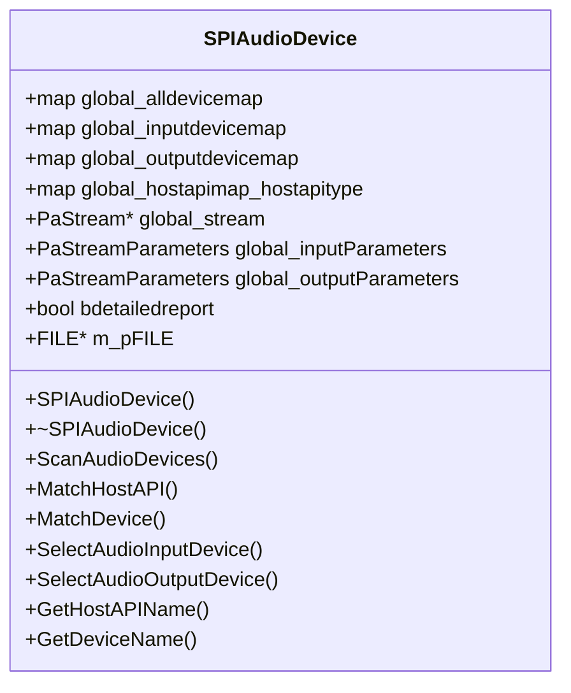

# Audio Device Selection and Configuration 🎛️

The **SPIAudioDevice** class centralizes PortAudio device management and stream configuration. It discovers available audio devices, maps them by host API and role (input/output), matches user preferences against these maps, and prepares PortAudio stream parameters. This enables the spectrum visualizer to flexibly select and configure audio I/O at runtime.

## Class SPIAudioDevice

This helper class encapsulates device discovery, matching, and PortAudio parameter setup. It exposes methods for scanning devices, matching host APIs and device names, selecting input/output devices, and retrieving human-readable names.

```cpp
// Declaration excerpt
class SPIAudioDevice {
public:
  std::map<int, string> global_alldevicemap;
  std::map<int, string> global_inputdevicemap;
  std::map<int, string> global_outputdevicemap;
  std::map<int, string> global_hostapimap_hostapitype;
  // … hostAPI-specific maps (DirectSound, MME, ASIO, WASAPI, ALSA, etc.)
  PaStream* global_stream;
  PaStreamParameters global_inputParameters;
  PaStreamParameters global_outputParameters;
  PaError global_err;
  string global_audioinputdevicename;
  string global_audiooutputdevicename;
  string global_audioinputhostapi;
  string global_audiooutputhostapi;
  int global_inputAudioChannelSelectors[2];
  int global_outputAudioChannelSelectors[2];
  bool bdetailedreport;
  FILE* m_pFILE;

  SPIAudioDevice();
  ~SPIAudioDevice();
  int ScanAudioDevices(string matchmode, spiaudiodevicetypeflag ioflag);
  int MatchHostAPI(string matchmode, spiaudiodevicetypeflag ioflag);
  int MatchDevice(string matchmode, spiaudiodevicetypeflag ioflag, int hostapitype);
  bool SelectAudioInputDevice();
  bool SelectAudioOutputDevice();
  string GetHostAPIName(int deviceid);
  string GetDeviceName(int deviceid);
};
```

Excerpted from the header definition .

## Data Members

| Member | Type | Description |
| --- | --- | --- |
| global_alldevicemap | map<int,string> | All PortAudio devices (ID → name). |
| global_inputdevicemap | map<int,string> | Input devices only (ID → name). |
| global_outputdevicemap | map<int,string> | Output devices only (ID → name). |
| global_hostapimap_hostapitype | map<int,string> | Host API type constants → display names (e.g., paASIO → "ASIO"). |
| global_hostapimap_directsound, … | map<int,string> × N | Device maps per host API (e.g., `global_hostapimap_asio`). |
| global_stream | PaStream* | Handle to the opened PortAudio stream. |
| global_inputParameters / global_outputParameters | PaStreamParameters | Configured PortAudio parameters for I/O. |
| global_err | PaError | Last PortAudio error code. |
| global_audioinputdevicename | string | User-specified input device name filter. |
| global_audiooutputdevicename | string | User-specified output device name filter. |
| global_audioinputhostapi | string | User-specified input host API name. |
| global_audiooutputhostapi | string | User-specified output host API name. |
| global_inputAudioChannelSelectors | int[2] | ASIO channel selectors for input streams. |
| global_outputAudioChannelSelectors | int[2] | ASIO channel selectors for output streams. |
| bdetailedreport | bool | Enable detailed device logging. |
| m_pFILE | FILE* | Optional file pointer for logging scan and match activities. |


## Mapping Host APIs

SPIAudioDevice builds a **host API → name** mapping to support flexible matching:

| Constant | Display Name |
| --- | --- |
| paDirectSound | "DIRECTSOUND" |
| paMME | "MME" |
| paASIO | "ASIO" |
| paWDMKS | "WDMKS" |
| paWASAPI | "WASAPI" |
| paALSA | "ALSA" |
| paCoreAudio | "COREAUDIO" |
| … | … |


These entries are inserted during `ScanAudioDevices` initialization .

## Key Methods

### 1. ScanAudioDevices

- **Purpose**: Populate all device and host API maps or match a specific device.
- **Behavior**:
- If `matchmode` is empty, clear and rebuild all maps by iterating `Pa_GetHostApiCount` and `Pa_GetDeviceCount`.
- Log device info and capabilities if `bdetailedreport` is true.
- If `matchmode=="loosely"`, perform string-based matching against user filters.
- **Returns**:
- For initialization: `paNoDevice`.
- For matching: matched device ID or `paNoDevice`.

```cpp
int SPIAudioDevice::ScanAudioDevices(string matchmode, spiaudiodevicetypeflag ioflag) { 
  // Clears and populates global_alldevicemap, input/output maps, host API maps.
  // Returns paNoDevice on init; device ID on match. 
}
```

Excerpted from implementation .

### 2. MatchHostAPI

- **Purpose**: Determine the PortAudio host API constant from user input.
- **Logic**:
- Uppercase `global_audio(input/output)hostapi`.
- Loop `global_hostapimap_hostapitype` to find substring matches.
- Log successes or ambiguities to `m_pFILE`.
- **Returns**: Matched `PaHostApiTypeId` or `-1` if unspecified.

```cpp
int SPIAudioDevice::MatchHostAPI(string matchmode, spiaudiodevicetypeflag ioflag) { 
  // Matches user-provided host API name loosely against known types.
}
```

.

### 3. MatchDevice

- **Purpose**: Find a device ID by matching the user’s device name filter.
- **Workflow**:
- Select proper device map (`global_inputdevicemap` or host API-specific map).
- Search for loose substring matches.
- Return first match; log warnings for multiples.
- **Inputs**: `matchmode`, `ioflag`, and optional `hostapitype`.
- **Returns**: Device ID or `paNoDevice`.

```cpp
int SPIAudioDevice::MatchDevice(string matchmode, spiaudiodevicetypeflag ioflag, int hostapitype) {
  // Iterates devicemap, matches global_audio(input/output)devicename.
}
```

Excerpt  .

### 4. SelectAudioInputDevice & SelectAudioOutputDevice

- **Purpose**: Configure `global_inputParameters` or `global_outputParameters` for PortAudio.
- **Steps**:
- Ensure device maps are populated (`ScanAudioDevices()`).
- Call `ScanAudioDevices("loosely", spiaudiodeviceINPUT/OUTPUT)` to pick device.
- Fall back to `Pa_GetDefaultInputDevice()` if no match (input only).
- Set `.device`, `.channelCount`, `.sampleFormat`, `.suggestedLatency`.
- Configure ASIO‐specific `hostApiSpecificStreamInfo` if applicable.
- **Returns**: `true` on success (`SelectAudioInputDevice` always returns true), `false` if output device not found.

```cpp
bool SPIAudioDevice::SelectAudioOutputDevice(){
  if(global_outputdevicemap.empty()) ScanAudioDevices();
  int deviceid = ScanAudioDevices("loosely", spiaudiodeviceOUTPUT);
  if(deviceid==paNoDevice) return false;
  global_outputParameters.device = deviceid;
  global_outputParameters.channelCount = global_numchannels;
  global_outputParameters.sampleFormat = PA_SAMPLE_TYPE;
  global_outputParameters.suggestedLatency = 
      Pa_GetDeviceInfo(deviceid)->defaultLowOutputLatency;
  // ASIO channel selectors if needed…
  return true;
}
```

.

### 5. GetHostAPIName & GetDeviceName

- **Purpose**: Translate a PortAudio device ID into a human-readable name.
- **Mechanism**: Linear search in `global_hostapimap` or `global_alldevicemap`.
- **Usage**: Display device labels in UI or logs.

```cpp
string SPIAudioDevice::GetDeviceName(int deviceid){
  // Look up deviceid in global_alldevicemap and return name.
}
```

.

## Integration in spispectrumplay.cpp

1. **Initialization**

```cpp
   mySPIAudioDevice.global_err = Pa_Initialize();
   if(mySPIAudioDevice.global_err != paNoError) { … }
```

1. **Device Selection**

```cpp
   pFILE = fopen("devices.txt","w");
   mySPIAudioDevice.m_pFILE = pFILE;
   mySPIAudioDevice.SelectAudioOutputDevice();
   fclose(pFILE);
```

Then `Pa_OpenStream` uses `mySPIAudioDevice.global_outputParameters`.

1. **Stream Startup**

```cpp
   Pa_OpenStream(&mySPIAudioDevice.global_stream,
                 NULL,
                 &mySPIAudioDevice.global_outputParameters,
                 SAMPLE_RATE, FRAMES_PER_BUFFER,
                 paClipOff,
                 renderCallback,
                 NULL);
   Pa_StartStream(mySPIAudioDevice.global_stream);
```

## Class Structure Diagram



## Best Practice Highlight

```card
{
    "title": "Detailed Device Logs",
    "content": "Enable bdetailedreport and set m_pFILE to capture full device capabilities and latency info."
}
```

*SPIAudioDevice* ensures the application can adapt to diverse audio setups, from simple MME playback to low-latency ASIO workflows, making the spectrum visualizer robust across Windows environments.