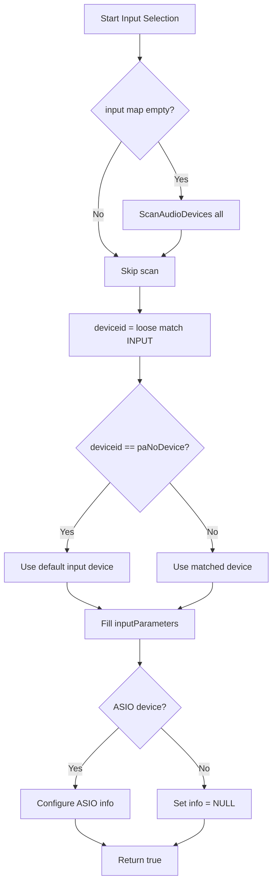

# Audio Device Selection and Configuration (SPIAudioDevice)

Configuring audio devices is central to initializing PortAudio streams. The `SPIAudioDevice` class handles device discovery, matching, and parameter setup for both **input** and **output**. This section dives into how `SelectAudioInputDevice()` and `SelectAudioOutputDevice()` work, their decision flows, and how they integrate with the broader application.

---

## SPIAudioDevice Class Overview

`SPIAudioDevice` encapsulates all logic for:

- Scanning available audio devices and host APIs
- Matching user-specified device names (loosely)
- Populating PortAudio parameters for streaming
- Handling ASIO-specific channel selectors when `PA_USE_ASIO` is enabled

Key members include maps of devices and host APIs, PortAudio stream parameters, and ASIO stream info structures .

---

## Dependencies and Integration

- **PortAudio** core API (`portaudio.h`)
- **ASIO** support (`pa_asio.h`, when `PA_USE_ASIO` is defined)
- **defs.h** for `PA_SAMPLE_TYPE`, buffer sizes, and channel count
- Global variables:
- `global_numchannels` (channel count)
- `global_inputAudioChannelSelectors` / `global_outputAudioChannelSelectors`
- `global_audioinputdevicename` / `global_audiooutputdevicename`

These dependencies ensure the class can query devices, read user preferences, and fill `PaStreamParameters` for opening streams.

---

## Selecting Input and Output Devices

Two primary methods configure PortAudio streams based on user-selected devices:

### 🎧 SelectAudioInputDevice()

Sets up **input** parameters by:

1. **Device Map Check**
2. If `global_inputdevicemap` is empty, call `ScanAudioDevices()` to populate all maps
3. **Loose Matching**
4. Resolve a device ID via

```cpp
     int deviceid = ScanAudioDevices("loosely", spiaudiodeviceINPUT);
```

1. **Fallback**
2. If `deviceid == paNoDevice`, use the default input device:

```cpp
     deviceid = Pa_GetDefaultInputDevice();
```

1. **Parameter Population**
2. `global_inputParameters.device       = deviceid`
3. `global_inputParameters.channelCount = global_numchannels`
4. `global_inputParameters.sampleFormat = PA_SAMPLE_TYPE`
5. `global_inputParameters.suggestedLatency = Pa_GetDeviceInfo(deviceid)->defaultLowOutputLatency`
6. **ASIO Configuration** (Windows only, when `PA_USE_ASIO`)
7. Populate `global_asioInputInfo` with host API type, version, flags, and `global_inputAudioChannelSelectors`
8. If the chosen device uses ASIO, set

```cpp
     global_inputParameters.hostApiSpecificStreamInfo = &global_asioInputInfo;
```

- Otherwise, `hostApiSpecificStreamInfo = NULL`

#### Input Parameter Summary

| 🎚️ Parameter | Source | Notes |
| --- | --- | --- |
| `device` | `deviceid` | Matched or default device |
| `channelCount` | `global_numchannels` | Configured in `defs.h` |
| `sampleFormat` | `PA_SAMPLE_TYPE` | Float32, Int16, etc. |
| `suggestedLatency` | `Pa_GetDeviceInfo(...)->defaultLowOutputLatency` | Optimal low-latency setting |
| `hostApiSpecificStreamInfo` | ASIO info or `NULL` | Based on host API type |


```cpp
bool SPIAudioDevice::SelectAudioInputDevice() {
    if (global_inputdevicemap.empty())
        ScanAudioDevices();
    int deviceid = ScanAudioDevices("loosely", spiaudiodeviceINPUT);
    if (deviceid == paNoDevice)
        deviceid = Pa_GetDefaultInputDevice();
    global_inputParameters.device       = deviceid;
    global_inputParameters.channelCount = global_numchannels;
    global_inputParameters.sampleFormat = PA_SAMPLE_TYPE;
    global_inputParameters.suggestedLatency =
        Pa_GetDeviceInfo(deviceid)->defaultLowOutputLatency;
#if PA_USE_ASIO
    // Configure ASIO selectors
    global_asioInputInfo.size             = sizeof(PaAsioStreamInfo);
    global_asioInputInfo.hostApiType      = paASIO;
    global_asioInputInfo.version          = 1;
    global_asioInputInfo.flags            = paAsioUseChannelSelectors;
    global_asioInputInfo.channelSelectors = global_inputAudioChannelSelectors;
    if (Pa_GetHostApiInfo(Pa_GetDeviceInfo(deviceid)->hostApi)->type == paASIO)
        global_inputParameters.hostApiSpecificStreamInfo = &global_asioInputInfo;
    else
        global_inputParameters.hostApiSpecificStreamInfo = NULL;
#else
    global_inputParameters.hostApiSpecificStreamInfo = NULL;
#endif
    return true;
}
```

*Excerpt from implementation*

---

#### Input Selection Flow



---

### 🎚️ SelectAudioOutputDevice()

Configures **output** parameters with a similar approach:

1. **Device Map Check**
2. Populate via `ScanAudioDevices()` if `global_outputdevicemap` is empty
3. **Loose Matching**
4. Resolve device ID:

```cpp
     int deviceid = ScanAudioDevices("loosely", spiaudiodeviceOUTPUT);
```

1. **No Fallback**
2. If `deviceid == paNoDevice`, the method returns `false` (unlike input, it does **not** default silently)
3. **Parameter Population**
4. `global_outputParameters.device       = deviceid`
5. `global_outputParameters.channelCount = global_numchannels`
6. `global_outputParameters.sampleFormat = PA_SAMPLE_TYPE`
7. `global_outputParameters.suggestedLatency = Pa_GetDeviceInfo(deviceid)->defaultLowOutputLatency`
8. **ASIO Configuration** (Windows + `PA_USE_ASIO`)
9. Populate `global_asioOutputInfo` similarly
10. Apply to `hostApiSpecificStreamInfo` only if the host API is ASIO; otherwise set to `NULL`

#### Output Parameter Summary

| 🎚️ Parameter | Source | Notes |
| --- | --- | --- |
| `device` | `deviceid` | Matched device, no silent default |
| `channelCount` | `global_numchannels` | From `defs.h` |
| `sampleFormat` | `PA_SAMPLE_TYPE` | Must match input sample type |
| `suggestedLatency` | `defaultLowOutputLatency` | System-recommended low latency |
| `hostApiSpecificStreamInfo` | ASIO info or `NULL` | Only for ASIO outputs |


```cpp
bool SPIAudioDevice::SelectAudioOutputDevice() {
    if (global_outputdevicemap.empty())
        ScanAudioDevices();
    int deviceid = ScanAudioDevices("loosely", spiaudiodeviceOUTPUT);
    if (deviceid == paNoDevice)
        return false;
    global_outputParameters.device       = deviceid;
    global_outputParameters.channelCount = global_numchannels;
    global_outputParameters.sampleFormat = PA_SAMPLE_TYPE;
    global_outputParameters.suggestedLatency =
        Pa_GetDeviceInfo(deviceid)->defaultLowOutputLatency;
#if PA_USE_ASIO
    global_asioOutputInfo.size             = sizeof(PaAsioStreamInfo);
    global_asioOutputInfo.hostApiType      = paASIO;
    global_asioOutputInfo.version          = 1;
    global_asioOutputInfo.flags            = paAsioUseChannelSelectors;
    global_asioOutputInfo.channelSelectors = global_outputAudioChannelSelectors;
    if (Pa_GetHostApiInfo(Pa_GetDeviceInfo(deviceid)->hostApi)->type == paASIO)
        global_outputParameters.hostApiSpecificStreamInfo = &global_asioOutputInfo;
    else
        global_outputParameters.hostApiSpecificStreamInfo = NULL;
#else
    global_outputParameters.hostApiSpecificStreamInfo = NULL;
#endif
    return true;
}
```

*Excerpt from implementation*

---

## Default Behavior in the Main Application

By design, the spectrum player focuses on **playback**. In `spispectrumplay.cpp`:

- **Output selection** is invoked by default:

```cpp
  mySPIAudioDevice.SelectAudioOutputDevice();
```

- **Input selection** is commented out to avoid live recording unless explicitly enabled.

---

```card
{
    "title": "Note on Fallbacks",
    "content": "Input selection falls back to the system default device, whereas output selection fails if no match is found."
}
```

---

## Best Practices & Recommendations

- **Define PA_USE_ASIO** when working with low-latency audio and ASIO hardware.
- **Specify host API and device name** using the syntax `<HostAPI>:<DeviceName>` for precise matching.
- **Log **`**m_pFILE**`** output** during development to audit device matching and latency reports.
- **Test on both 32-bit and 64-bit targets** to ensure consistent device enumeration across builds.

By centralizing device logic in `SPIAudioDevice`, the application cleanly separates configuration from streaming and visualization, ensuring maintainable and extensible audio handling.