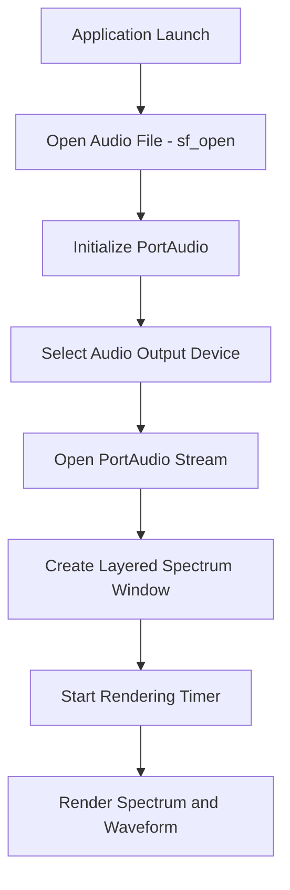

# Building and Running the Application

This section covers how to launch **spispectrumplay**, ensuring the audio file is in place and explaining the startup sequence. After building, you will place an audio file, start the executable, and observe the layered spectrum window as audio plays.

## Running the Application

Once you have successfully built the application (see previous sections), follow these steps to run it:

1. Place the audio file
2. Copy **testbeat2.w64** (or any compatible file) into the working directory.
3. By default, the global variable `global_filename` is set to `"testbeat2.w64"`.
4. The application calls **sf_open** to open the file for reading.

```cpp
     global_pSNDFILE = sf_open(global_filename.c_str(), SFM_READ, &global_SF_INFO);
     if (!global_pSNDFILE) {
         MessageBox(0, "Error, Can't open file\n", 0, MB_ICONERROR);
         return 1;
     }
```

If `sf_open` fails, a **MessageBox** appears and startup aborts .

```card
{
    "title": "Tip",
    "content": "Ensure your audio file matches the sample rate and channel count expected by the application."
}
```

1. Launch the executable
2. In **Visual Studio 2022**, choose **Start Debugging** (F5).
3. Or run the `.exe` directly from the `bin\Debug` or `bin\Release` folder.

1. Observe the startup sequence 🎛️🔊🖥️

The program performs several initialization steps in order:

| Step | Function / Component | Description |
| --- | --- | --- |
| 1. PortAudio initialization | `Pa_Initialize()` | Initializes the PortAudio engine; errors show a MessageBox . |
| 2. Device selection | `SPIAudioDevice::SelectAudioOutputDevice()` | Scans and picks the best output device, logs details to `devices.txt` . |
| 3. Stream setup | `Pa_OpenStream(..., renderCallback, NULL)` | Opens a callback stream feeding audio data and FFT buffers . |
| 4. Start stream | `Pa_StartStream()` | Begins audio playback; errors show a MessageBox . |
| 5. Window creation | `CreateWindow(..., global_title.c_str(), ... )` | Creates a layered, semi-transparent window of size **500×250** . |
| 6. Alpha blending | `SetLayeredWindowAttributes(hWnd, 0, global_alpha, LWA_ALPHA)` | Applies window transparency (`global_alpha = 200`) . |
| 7. Rendering timer | `timeSetEvent(...)` | Fires regularly to invoke **UpdateSpectrum**, drawing to a DIBSection. |
| 8. Render loop | `BitBlt(...)` | Blits the DIBSection to the visible window each timer tick . |




1. Interact with the spectrum window 👆
2. The window title defaults to **spispectrumplay (click to toggle mode)** .
3. **Left-click** cycles forward through display modes.
4. **Right-click** cycles backward.

Enjoy real-time audio visualization!