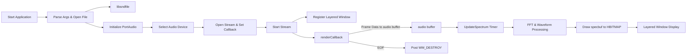

# Project Structure and Source Files – spispectrumplay.cpp (Main Application)

This central source file implements the Windows GUI, audio streaming logic, FFT processing, and drawing code for the spectrum visualizer. It coordinates file I/O (via libsndfile), audio I/O (via PortAudio with ASIO support), FFT computation (via rfftw), and real-time rendering in a layered semi-transparent window.

## Includes and Dependencies

spispectrumplay.cpp brings together multiple libraries and headers to enable audio playback and visualization:

| Header/File | Purpose |
| --- | --- |
| `<windows.h>` | Core Win32 API for window management and GDI |
| `<stdio.h>`, `<math.h>`, `<malloc.h>` | Standard C I/O, math functions, memory allocation |
| `"portaudio.h"` | PortAudio core API |
| `"pa_asio.h"` | ASIO host-API support on Windows (conditional) |
| `<fourier.h>` | FFT wrapper around rfftw for frequency-domain transforms |
| `"defs.h"` | Application constants (SAMPLE_RATE, FRAMES_PER_BUFFER, etc.) |
| `"spiaudiodevice.h"` | SPIAudioDevice class for device enumeration/selection |
| `"resource.h"` | Resource IDs (e.g., icon) for the Win32 resource script |
| `<vector>`, `<string>`, `<map>` | C++ STL containers for parameters and device mappings |


```cpp
#include <windows.h>
#include <stdio.h>
#include <math.h>
#include <malloc.h>
#include "portaudio.h"
#ifdef WIN32
  #if PA_USE_ASIO
    #include "pa_asio.h"
  #endif
#endif
#include "defs.h"
#include "spiaudiodevice.h"
#include "resource.h"
#include <vector>
#include <string>
#include <map>
#include <fourier.h>
```

Excerpt showing core includes .

## Definitions and Global Variables

A suite of global variables control audio parameters, visualization modes, window attributes, and buffers:

- **Audio & FFT Constants**
- `NUM_CHANNELS`, `SAMPLE_RATE`, `FRAMES_PER_BUFFER`: from defs.h
- `PA_SAMPLE_TYPE`, `SAMPLE` typedef: from defs.h
- **Device Management**
- `SPIAudioDevice mySPIAudioDevice;` – wraps PortAudio device selection
- `PaStream* global_stream;` – audio stream handle
- **Libsndfile Integration**
- `string global_filename = "testbeat2.w64";`
- `SNDFILE* global_pSNDFILE = NULL; SF_INFO global_SF_INFO;`
- **Visualization Parameters**
- `int SPECWIDTH = 500; SPECHEIGHT = 250;`
- `int specmode = 0, specpos = 0;`
- `int global_bands = 20; int global_idcolorpalette = 0;`
- **Window Attributes**
- `BYTE global_alpha = 200;` – window transparency
- `int global_x = 200, global_y = 200;` – initial position
- `string global_classname, global_title;` – window class/title
- **Audio Buffers & Flags**
- `bool audiobuffer_ready = false;`
- `float audiobuffer[MAX], buf[MAX], buf2[MAX], fftbuf[MAX];`

## libsndfile Integration

spispectrumplay.cpp uses libsndfile to read audio frames from a file and stream them via PortAudio:

1. **Opening the File**

```cpp
   if (!(global_pSNDFILE = sf_open(global_filename.c_str(), SFM_READ, &global_SF_INFO))) {
       MessageBox(0, "Error, Can't open file\n", 0, MB_ICONERROR);
       return 1;
   }
```

Error handling on failure .

1. **Reading Frames in Callback**

```cpp
   sf_count_t itemsread = sf_readf_float(global_pSNDFILE, (float*)outputBuffer, framesPerBuffer);
   if (itemsread == 0) {  // End of file
       sf_close(global_pSNDFILE);
       PostMessage(win, WM_DESTROY, 0, 0);
       return paComplete;
   }
```

Streams frames to PortAudio output buffer .

## PortAudio Initialization and renderCallback

1. **Initialization & Device Selection**

```cpp
   Pa_Initialize();
   mySPIAudioDevice.SelectAudioOutputDevice();
```

1. **Opening & Starting Stream**

```cpp
   Pa_OpenStream(&mySPIAudioDevice.global_stream,
                 NULL,
                 &mySPIAudioDevice.global_outputParameters,
                 SAMPLE_RATE,
                 FRAMES_PER_BUFFER,
                 paNoFlag,
                 renderCallback,
                 NULL);
   Pa_StartStream(mySPIAudioDevice.global_stream);
```

Error dialogs on failure .

1. **renderCallback Function**

```cpp
   static int renderCallback(const void *inputBuffer, void *outputBuffer,
                             unsigned long framesPerBuffer,
                             const PaStreamCallbackTimeInfo* timeInfo,
                             PaStreamCallbackFlags statusFlags,
                             void *userData) {
       if (global_abort) return paAbort;
       // File playback branch
       sf_count_t itemsread = sf_readf_float(global_pSNDFILE, (float*)outputBuffer, framesPerBuffer);
       if (itemsread == 0) { /* handle EOF */ }
       audiobuffer_ready = true;
       memcpy(audiobuffer, outputBuffer, sizeof(float)*NUM_CHANNELS*framesPerBuffer);
       return paContinue;
   }
```

Manages file read, EOF, buffer copy .

## FFT Processing & Visualization

A Windows timer invokes **UpdateSpectrum**, which:

- Computes FFT on the latest audio buffer:

```cpp
  fft(buf2, fftbuf, numberofsamples);
  for (int i = 0; i < numberofsamples; i++)
      fftbuf[i] = abs(fftbuf[i]);
```

- Maps magnitudes to pixel buffer (`specbuf`) for multiple **specmode** patterns (bars, filled waveforms, 3D effects).
- Uses helper `getv()` to scale sample amplitudes to screen height .
- Renders to an 8-bit `HBITMAP` with dynamic color palettes set in `WM_CREATE` .

## Window Creation & Message Loop

1. **Register & Create Layered Window**

```cpp
   WNDCLASS wc = { 0 };
   wc.lpfnWndProc   = (WNDPROC)SpectrumWindowProc;
   wc.hInstance     = hInstance;
   wc.hCursor       = LoadCursor(NULL, IDC_ARROW);
   wc.hIcon         = LoadIcon(hInstance, MAKEINTRESOURCE(IDI_ICON1));
   wc.lpszClassName = global_classname.c_str();
   RegisterClass(&wc);
   win = CreateWindow(global_classname.c_str(),
                      global_title.c_str(),
                      WS_POPUP | WS_VISIBLE,
                      global_x, global_y,
                      SPECWIDTH, SPECHEIGHT,
                      NULL, NULL, hInstance, NULL);
   SetWindowLong(win, GWL_EXSTYLE,
                 GetWindowLong(win, GWL_EXSTYLE) | WS_EX_LAYERED);
   SetLayeredWindowAttributes(win, 0, global_alpha, LWA_ALPHA);
```

Enables semi-transparent layered window .

1. **Message Loop**

```cpp
   MSG msg;
   while (GetMessage(&msg, NULL, 0, 0) > 0) {
       TranslateMessage(&msg);
       DispatchMessage(&msg);
   }
```

Dispatches `WM_TIMER` to update the spectrum and `WM_LBUTTONDOWN` to toggle modes.

---



This flow illustrates how spispectrumplay.cpp orchestrates file I/O, audio streaming, FFT processing, and real-time rendering in a unified application.