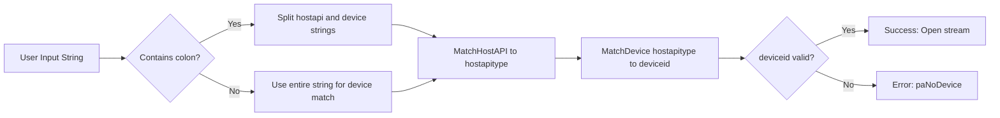

# Troubleshooting and Known Limitations – Device and Host API Matching Pitfalls

This section highlights common issues when selecting audio devices via **SPIAudioDevice**’s loose substring matching of host APIs and device names. It explains why ambiguous or overly short strings can lead to unexpected behavior and offers strategies to avoid pitfalls.

---

## How Matching Works

SPIAudioDevice uses two core methods to map user-provided strings to PortAudio APIs and devices:

- **MatchHostAPI**
- Iterates over `global_hostapimap_hostapitype` (e.g., `"MME"`, `"ASIO"`, `"WASAPI"`)
- Performs `std::string::find` in both directions (user string vs. map value)
- On first match, records `hostapitype`; logs warnings if multiple matches occur or none found

- **MatchDevice**
- Chooses a device map based on `hostapitype` (or input/output)
- Uses the same bidirectional substring search for device names
- Returns `deviceid` or `paNoDevice` if no match found

```cpp
// Pseudocode for MatchHostAPI
for each (type, name) in global_hostapimap_hostapitype:
    if userString contains name OR name contains userString:
        if firstMatch not set:
            hostapitype = type
        else:
            log warning: multiple host APIs matched
return hostapitype  // -1 if none matched
```

---

## Common Pitfalls

| Pitfall | Result |
| --- | --- |
| Multiple partial matches | First match retained; warnings logged; unexpected API/device chosen |
| No matches at all | `hostapitype == -1` → `MatchHostAPI` warns; `deviceid = paNoDevice` |
| Overly generic or short strings | E.g., `"WAS"` matches both `"WASAPI"` and `"SOUNDMANAGER"` mappings |
| Combining without proper separator | `"WASAPIMyDevice"` not split → only device search, no host API match |


> ❗ **Warning:** When no host API matches, **MatchDevice** falls back to a default mapping (usually MME) but may still return `paNoDevice` if the device string is empty.

---

## Separator Handling (`:` Format)

If you prefix your input with `hostapi:devicename`, SPIAudioDevice splits at the first `:` and matches each part independently:

```cpp
size_t pos = userString.find(":");
if (pos != string::npos) {
    hostapiPart = userString.substr(0, pos);
    devicePart  = userString.substr(pos+1);
    // Match host API...
    // Then match device within that API
}
```

This ensures precise API selection before device lookup .

---

## Mitigation Strategies

- **Use full, specific API names**
- ✅ `"Windows WASAPI"` or `"WASAPI"` instead of `"WAS"`
- ✅ `"ASIO"` rather than `"A"`
- **Always inspect the exact names**
- Run `ScanAudioDevices()` with a log file (e.g., `devices.txt`) to see each `hostapistring` and `devicenamestring`.
- **Employ the **`**hostapi:devicename**`** convention**
- Ensures host API and device are matched separately
- **Avoid substrings that appear in multiple mappings**
- Check for duplicate mappings (e.g., `"COREAUDIO"` vs. `"SOUNDMANAGER"` both under JACK)

```bash
# Example usage:
# To target WASAPI on a specific device
./spispectrumplay.exe "Windows WASAPI:Microphone Array"
```

---

## Selection Flow



---

## 📋 Key Takeaways

```card
{
    "title": "Best Practices",
    "content": "Specify full host API names and split with ':' to avoid ambiguity."
}
```

- **Always** verify the exact API and device listings via a scan log.
- **Prefer** explicit input like `"ASIO:Focusrite USB"` over general terms.
- **Review** warnings in the device log for multiple or missing matches.

By following these guidelines, you’ll minimize unexpected audio-device selections and ensure reliable operation across varied Windows audio APIs.