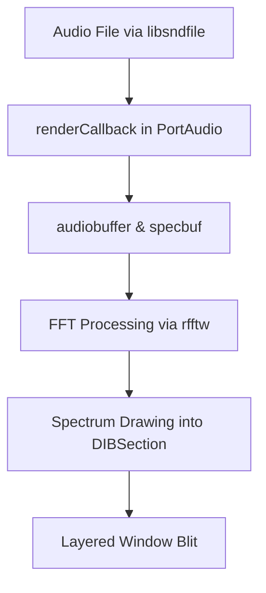

# Using the Audio Spectrum Visualizer – Core Features and Behavior

This section dives into how the application loads audio, streams it for playback, processes data for visualization, and renders the spectrum in a layered window. You’ll learn about key global variables, buffer management, spectrum modes, color palettes, and integration with PortAudio and FFT libraries.

---

## 🎵 Audio File Loading and Metadata

The app opens an audio file via **libsndfile**, storing the handle and format information in global variables.

- **SNDFILE\*** *global_pSNDFILE* holds the open file handle.
- **SF_INFO** *global_SF_INFO* contains sample rate, channels, and format.
- Default file is `testbeat2.w64`, configurable via **global_filename** or command-line args .
- On failure, shows an error and aborts startup .

```c
if (!(global_pSNDFILE = sf_open(global_filename.c_str(),
     SFM_READ, &global_SF_INFO))) {
  MessageBox(0, "Error, Can't open file\n", 0, MB_ICONERROR);
  return 1;
}
```

---

## 🔊 Audio Streaming and PortAudio Initialization

Playback uses PortAudio with optional ASIO support:

- **Pa_Initialize()** sets up PortAudio.
- **SelectAudioOutputDevice()** chooses the output device and configures **PaAsioStreamInfo** when `PA_USE_ASIO=1` .
- **Pa_OpenStream()** opens a stream with **renderCallback** to feed audio .
- **renderCallback** reads frames with `sf_readf_float`, writes into the output buffer, and handles end-of-file:

```c
sf_count_t items = sf_readf_float(global_pSNDFILE,
                     (float*)outputBuffer, framesPerBuffer);
if (items == 0) {
  if (global_fSecondsPlay <= 0) {
    sf_seek(global_pSNDFILE, 0, SEEK_SET);  // loop
    items = sf_readf_float(global_pSNDFILE,
            (float*)outputBuffer, framesPerBuffer);
  }
}
memcpy(audiobuffer, outputBuffer,
       sizeof(float)*framesPerBuffer*NUM_CHANNELS);
audiobuffer_ready = true;
return paContinue;
```

---

## 🧮 Buffers and FFT Processing

To visualize audio, the app maintains large float buffers sized for high-resolution displays:

| Buffer Name | Purpose |
| --- | --- |
| **audiobuffer** | Raw interleaved samples from callback |
| **buf**, **buf2** | Time-domain copies for waveform modes |
| **fftbuf** | Frequency-domain data after FFT |


All arrays use `SPECTRUMWINDOW_MAXAUDIOBUFFERSIZE`, derived from maximum channels and `FRAMES_PER_BUFFER` . Before FFT, data is copied into **buf2**, then transformed via `fft()` from rfftw/FFTW.

```c
while (!audiobuffer_ready) Sleep(1);
memcpy(buf2, audiobuffer,
       sizeof(float)*NUM_CHANNELS*FRAMES_PER_BUFFER);
fft(buf2, fftbuf, FRAMES_PER_BUFFER);
for (int i = 0; i < FRAMES_PER_BUFFER; i++)
  fftbuf[i] = fabs(fftbuf[i]);
```

---

## 🎚️ Spectrum Modes and Rendering Behavior

The visualizer supports multiple rendering styles, controlled by **specmode**, **specpos**, and **prev_specmode**:

- **specmode** indexes up to 18 different styles (, , , ) .
- **specpos** advances as a horizontal marker in scrolling modes.
- Left/right mouse clicks cycle modes and **memset** the display to clear previous frames .

```c
case WM_LBUTTONUP:
  specmode = (specmode + 1) % 19;
  memset(specbuf, 0, SPECWIDTH * SPECHEIGHT);
  return 0;
```

---

## 🎨 Color Palette Configuration

Visual themes are set via **global_idcolorpalette**, building an 8-bit DIBSection palette:

| ID | Theme | Palette Behavior |
| --- | --- | --- |
| ---: | -------------------------------- | ------------------------------------------ |
| 0 | Original (green → red) | `pal[a].rgbGreen=256-2*a; pal[a].rgbRed=2*a;` |
| 1 | Red → green | Inverse of ID 0 |
| 2 | Blue → green | Blue fades as green increases |
| 3 | Grayscale (black → white) | `rgbRed=rgbGreen=rgbBlue=a;` |
| … | *Additional themes up to 7* | *Pink, yellow, cyan, lite green, etc.* |


```c
if (global_idcolorpalette == 3) {
  for (int a = 1; a < 256; a++)
    pal[a].rgbRed = pal[a].rgbGreen = pal[a].rgbBlue = a;
}
```

---

## 🖥️ Display Window and Layered Rendering

The spectrum is drawn into an offscreen **DIBSection** and blitted to a semi-transparent layered window:

1. **WM_CREATE** sets **WS_EX_LAYERED** and `SetLayeredWindowAttributes` using **global_alpha** for opacity .
2. **CreateDIBSection** with 8-bit color and the palette, obtaining **specbuf** pointer.
3. A periodic timer (40 Hz) calls **UpdateSpectrum**, which blits from the offscreen DC to the window.

```c
specbmp = CreateDIBSection(0, (BITMAPINFO*)bh,
             DIB_RGB_COLORS, (void**)&specbuf, NULL, 0);
specdc = CreateCompatibleDC(0);
SelectObject(specdc, specbmp);
timer = timeSetEvent(25, 25, UpdateSpectrum, 0, TIME_PERIODIC);
```

---

## 🔗 Dependencies and Integration

This module ties together multiple libraries and components:

- **libsndfile** for file I/O and metadata.
- **PortAudio** (with **ASIO** support) for low-latency audio output.
- **rfftw/FFTW** (via `fourier.h`) for FFT transforms.
- **SPIAudioDevice** class handles device enumeration and selection .
- **Windows GDI** for offscreen bitmaps and layered window support.



---

By understanding these core elements—file loading, streaming, buffering, rendering modes, color palettes, and GDI integration—you can customize or extend the visualizer to suit new audio formats, display layouts, or visual themes.