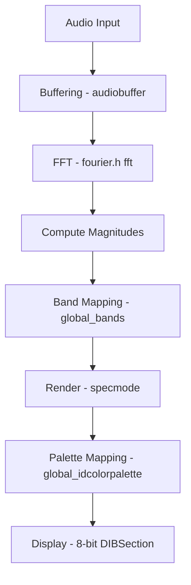

# Using the Audio Spectrum Visualizer – Spectrum and FFT Visualization Logic (Conceptual)

This section explains how the application derives its real-time spectrum and waveform visualizations. Understanding these internals can help you fine-tune parameters like **SPECWIDTH**, **SPECHEIGHT**, **global_bands**, and **global_idcolorpalette** to achieve different visual effects.

---

## Audio Buffering and Size Management

Audio samples are streamed from PortAudio and stored in large floating-point arrays before visualization.

- **Maximum buffer size** is defined by:

```c
  #define SPECTRUMWINDOW_MAXAUDIOBUFFERSIZE \
      (2 * SPECTRUMWINDOW_MAXNUMCHANNELS * SPECTRUMWINDOW_MAXFRAMESPERBUFFER)
  float audiobuffer[SPECTRUMWINDOW_MAXAUDIOBUFFERSIZE];
```

This accommodates up to two channels and double the frames per buffer, ensuring support for wide or high-density displays.

- **Frame size** and **channel count** come from *defs.h*:

```c
  #define FRAMES_PER_BUFFER (2048)
  #define NUM_CHANNELS      (2)
```

These drive the effective buffer usage per update cycle.

---

## Fourier Transformation via fourier.h

The transition from time domain to frequency domain uses a simple wrapper around the RFFTW library:

```c
#include <fourier.h>  // Provides fft() and ifft()

// Perform FFT on interleaved samples:
fft(buf2, fftbuf, numberOfSamples);
```

- **fft()** assumes a fixed transform size **N** on its first call and reuses the FFT plan for efficiency.
- **ifft()** (not shown) performs the inverse transform.
- Magnitudes are computed immediately after:

```c
  for (int i = 0; i < numberOfSamples; i++)
      fftbuf[i] = fabsf(fftbuf[i]);
```

---

## Mapping FFT Magnitudes to Spectrum Bands

To map raw FFT bins into displayable spectrum bands:

1. **Determine band count**

```c
   global_bands = SPECWIDTH / 16; 
   if (global_bands < 4) global_bands = 4;
   if (global_bands > FRAMES_PER_BUFFER - 2)
       global_bands = FRAMES_PER_BUFFER - 2;
```

1. **Compute bin ranges** for each band (logarithmic or linear):

```c
   for (x = 0; x < global_bands; x++) {
       int b0 = previousBin;
       int b1 = powf(2, x * 10.0f / (global_bands - 1));
       b1 = clamp(b1, b0 + 1, numberOfSamples - 1);
       // Find peak magnitude in [b0, b1)
   }
```

1. **Scale magnitudes** using square-root or linear transforms to emphasize low-level content:

```c
   y = sqrtf(peak) * 3 * SPECHEIGHT - 4;
   y = clamp(y, 0, SPECHEIGHT);
```

This strategy avoids overruns and keeps low frequencies visually prominent.

---

## Rendering Modes (specmode Variants)

The **specmode** variable selects among multiple visualization styles:

| specmode | Style | Description |
| --- | --- | --- |
| 0 | ❚❚ Vertical Bar Graph | One column per band; smooth interpolation |
| 1 | 🔊 Logarithmic Bands | Log-scale bands; averaged peaks |
| 2 | ⏩ Scrolling Spectrogram | New FFT rows appended; older rows faded or scrolled |
| 3–6 | 📈 Waveform Overlays | Time-domain traces with or without fills |
| 7–10 | 🎲 Noisy Background | Waveform or spectrum on random background |
| 11–14 | ⬜ Shifting Solid Background | Subtle random fill behind data |
| 15–18 | 🌈 Radical Background | Bold random fills for artistic effect |


<aside>

💡 **Tip:** Click left/right mouse buttons to cycle **specmode** and observe how each style interprets the same FFT data.

</aside>

---

## Color Palettes

Visual richness comes from assigning a **256-entry RGB palette** to an 8-bit DIBSection. Each **global_idcolorpalette** value defines a unique gradient:

| ID | Palette | Effect |
| --- | --- | --- |
| 0 | Green → Red | Classic spectrum |
| 1 | Red → Green | Inverted hue |
| 2 | Blue → Green | Cool tones |
| 3 | Black → White (Grayscale) | Monochrome |
| 4 | Pink | Vibrant magenta |
| 5 | Yellow | Warm gold |
| 6 | Cyan | Aquatic blue-green |
| 7 | Light Green | Pastel mint |


```c
for (a = 1; a < 128; a++) {
    pal[a].rgbGreen = 256 - 2*a;
    pal[a].rgbRed   = 2*a;
}
// ... additional ranges for full 256 entries
```

Palettes are built during **WM_CREATE** before the timer starts.

---

## Putting It All Together



1. **Audio Input** (PortAudio) fills `audiobuffer`.
2. **FFT** converts time-domain to frequency-domain.
3. **Magnitudes** derived and **mapped** into `global_bands`.
4. **Render mode** (`specmode`) chooses drawing style.
5. **Palette** colors map intensity to RGB values.
6. **BitBlt** copies the DIBSection to the layered window.

---

## Impact of Key Parameters

| Parameter | Role | Effect of Change |
| --- | --- | --- |
| **SPECWIDTH** | Horizontal resolution (pixels) | More bands or finer detail |
| **SPECHEIGHT** | Vertical resolution (pixels) | Greater dynamic range |
| **FRAMES_PER_BUFFER** | FFT input size | Frequency resolution vs. update rate |
| **global_bands** | Number of displayed frequency bands | Bandwidth per band; higher for panoramic views |
| **global_idcolorpalette** | Palette selection | Dramatically alters mood and style |


Adjust these to match display size and artistic goals. Larger **SPECWIDTH** with more **global_bands** produces denser, high-resolution spectrums, while smaller values yield bold, block-like visuals.

---

**By mastering these internals, you can customize and extend the spectrum visualizer for unique applications, from subtle background meters to dynamic audio art installations.**